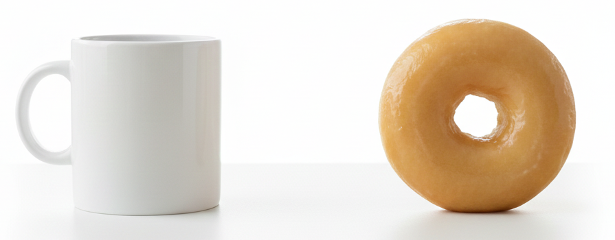

先日会社の飲み会にて数学の話題になりました。
そこで文系出身の先輩から「（大学）数学における理解は**分類**だと聞いたけど、そうなの？」と聞かれました。
確かにそういう一面[^1]はあると感じたのですが、その場でうまく言語化できなかったので、改めて整理してみました。
ちなみに私は幾何学屋さんなので図形を例に出すことが多いです。

## 個別よりも対象全体が気になる

高校までの数学だと個別具体のケースに対して頭を使うことが多い気がします。

- 「この図形の面積を求めよ」
- 「この関数を積分せよ」

一方、大学数学だと扱う対象全体が持つ性質に興味があります。

- 「~~~という**図形全体**が持つ性質は？」
- 「今までより**たくさんの関数**に適用できるように積分の定義を拡張したい」

個別具体から対象全体へ、より抽象的な方向へ興味が移動しているイメージです[^2]。

## 分類するには「同じ」を決めないといけない

「対象全体を理解したい」と思ったとき、我々は無限にある個体すべてを一つずつ調べることはできません。
そこで、似たもの同士をまとめて「分類」して整理したくなります。
ここで重要になるのが「どこまでが似たもの同士なのか？」という境界線を引くことです。
この境界線を引く作業を「同じ（同値関係）を定義する」と呼びます。
「同じ」のルールを厳しくすれば、箱の数は増えて細かくなり、ルールを緩くすれば、箱の数は減ってシンプルになります。
「同じ」をどう決めるかは、その対象をどのくらいの「解像度」で見ていきたいかに依存します。

ここでは「図形全体」を対象として「同じ」の定義の例を挙げてみます。

### 例1-1. 合同

2つの図形がぴったり重なるとき「合同」といいます。
別々の位置に置いてあっても、片方を移動して重なればそれは「同じ」とみなすルールです。
これは、置いてある位置はどうでもよく「形と大きさ」こそが本質だ、と宣言しているようなものです。

### 例1-2. 相似

2つの図形が片方を拡大・縮小してぴったり重なるとき「相似」といいます。
位置だけでなく大きさもどうでもよく「形」こそが本質だ、という宣言です。
相似の方が合同より「ゆるい」ルールになります。

### 例1-3. ホモトピー同値

さらに荒っぽい話をします。
2つの図形がびよ～んと伸び縮みするゴムでできているとします。
片方の図形を**切ったりくっつけたりすることなく伸び縮みさせる**ことで、もう片方とぴったり重なるとき「ホモトピー同値」といいます。
よくある例だとコーヒーカップとドーナッツはホモトピー同値です。

もはや「形」すらどうでもよいという宣言で、相似より（かなり）「ゆるい」ルールになります。

## 「同じ」を決めたら考えたくなる「不変量」

さて、興味のある「対象全体」と調べる「解像度」（=「同じ」の定義）が決まったとしましょう。
対象同士が「同じ」かどうか、直接調べるのは結構骨が折れます。
そこで「不変量」という性質に注目します。

「同じ」ならば絶対に変化しない性質のことを「不変量」といいます。
言い換えると、些細な違いには影響されない本質的な性質が「不変量」です。

先程同様「図形全体」を調べる対象として、不変量の例を挙げます。

### 例2-1. 合同

図形の辺の長さ、角度、面積などは合同に対する不変量です[^3]。
なぜなら、図形の位置を変化させてもそれらは変化しないからです。

図形の位置関係は不変量ではありません（「図形Aは図形Bの上にある」など）。
当然位置を変えたら位置関係は変わってしまいます。
些細な違いで崩れてしまう大したことない性質、という気分になります。

### 例2-2. 相似

図形の角度や辺の比は相似に対する不変量です。
一方、辺の長さや面積は不変量ではありません（図形を拡大コピーしたら、長さや面積も増えてしまいますね）。
角度や辺の比は大きさを変えても保たれる強い性質だと言えます。

### 例2-3. ホモトピー同値

かなり荒っぽくグニャグニャと変形させても変化しない性質は何があるでしょうか？
最も有名な例は「穴の数」です。
切ったりくっつけたりすることは禁止なので、穴の数を減らしたり増やしたりすることはできません。
角度や辺の性質は相似までは耐えていましたが、ホモトピー同値では崩れ去ってしまいます。
かたや、穴の数という性質はかなり荒っぽく図形を変形させても保たれるより本質的な不変量なことが分かります。

## 不変量を見て分類する

不変量を見ると対象を分類することができます。
例えば

- 図形Aの穴の数は1個
- 図形Bの穴の数は2個

だと分かったとします。
「図形AとBがホモトピー同値なら穴の数は一致」します（不変量の定義）。
対偶をとると「穴の数が違ったら、ホモトピー同値ではない」が言えます。
つまり、図形AとBは「同じ」ではない、ということが分かります。
この例だと

「図形全体」を「ホモトピー同値」という解像度[^4]で「穴の数」という不変量を用いて分類できそうだ

ということが分かりました（じゃあ実際にどうやって穴の数を求めるの？そもそも穴の数って何？どうやって定義するの？...という話題になっていきます）。

## なぜ分類するのか？

いろいろ脱線しましたが、こんな感じで「対象全体」を分類すると、整理されて理解できたような気がしてきます。
そうすると次に「そもそも分類して何が嬉しいの？目的は？」と言われそうです[^5]。
これについてズバッと返せる回答を私は持ち合わせていないです。
「基礎研究は知的好奇心を満たすこと重要で分類・理解すること自体が目的です」と言いたいところですが、どうでしょうか...？
ちなみに東大の河東泰之先生は以下のようにおっしゃっています。

> 分類理論はしばしば当然目指すべきものとされ，
なぜ分類したいかは問われないことが多い．しか
しどちらかというと，分類理論は分類しようとす
る努力によって生み出された手法，その経過で発
見された新しい例や現象の方が長期的に見れば数
学の発展にとって有意義なのではないだろうか．た
とえばポアンカレ予想は，これこれの条件を満た
すものは球面しかありませんよ，と言っているの
だから，何も新しいものはないという種類の結果
である．だから結果自体は (明らかに重要だが) 面
白みに欠けるという言い方もできる．しかし，解
決の過程で考え出されたさまざまな新しい手法が
今後長い間数学の発展を支えていくのであろう．[^6]

「何のために数学をするの？」に対する回答のレパートリーを多くしたいと思った最近でした。

[^1]: 分類は理解の十分条件だと思っています。
[^2]: 個別具体の値を求めることを「計算」と呼ぶ気がします。抽象を理解するには個別具体の「計算」も大切なので、高校までの数学の考えも重要だと思います。
[^3]: 本当は多角形以外や2次元以外の図形も考慮に入れるべきですが、ここでは無視しましょう。
[^4]: （雑に言うと）図形を「相似」レベルで調べる分野を微分幾何学（形が大事）、「ホモトピー同値」レベルで調べるのを位相幾何学（トポロジー）と言います。
[^5]: 仕事だと理解しただけでは無意味で、その結果アクションに繋げることが大切だと思います。数学と仕事のgapに苦しんだ時期を思い出します。
[^6]: https://www.ms.u-tokyo.ac.jp/~yasuyuki/suri1310.pdf

